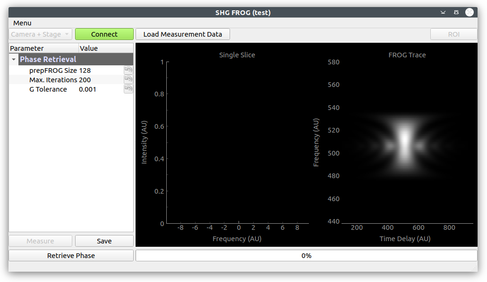
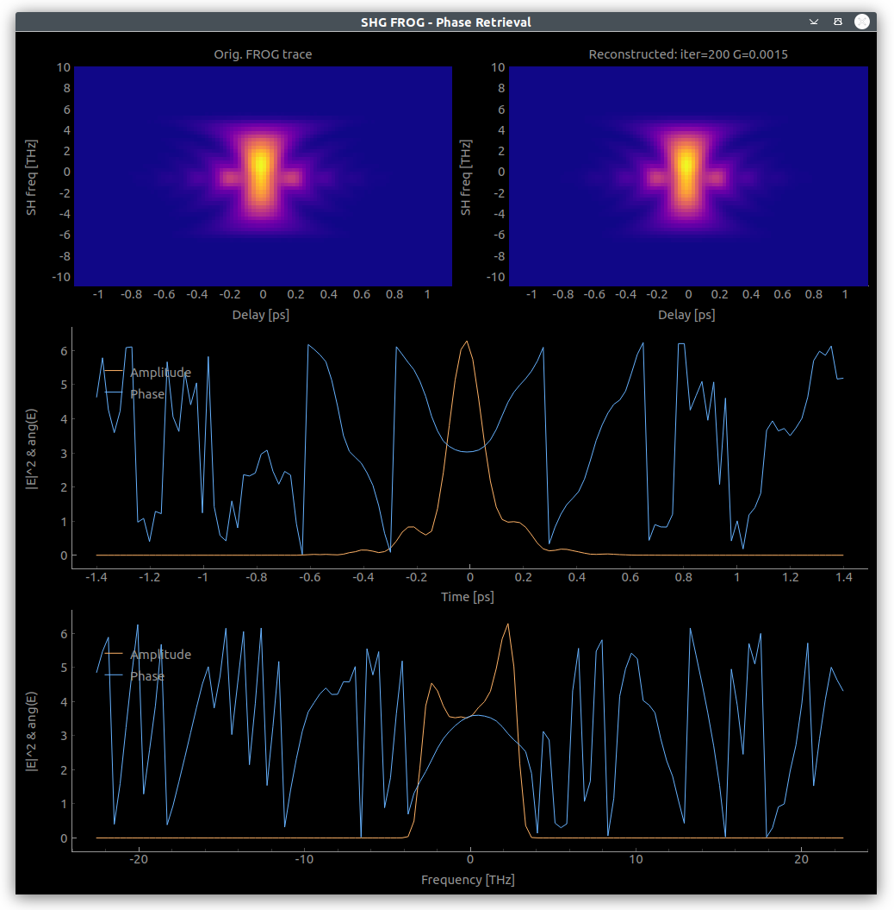

# shg_frog

[](https://github.com/jkrauth/shg_frog/blob/main/LICENSE)

Software for measurement and characterization of ultra-fast laser pulses using the __SHG FROG__ technique.

> Want to know more about FROG?
> R. Trebino, Frequency-Resolved Optical Gating: the Measurement of Ultrashort Laser Pulses, Kluwer, Boston (2002)

Commercial devices exist, but are rather expensive. A home-built device can save a lot of money.
The code in this repository provides:

* A graphical user interface for the measurement of the so-called FROG trace.
* The possibility to choose between two different phase retrieval algorithms:
  * GP (generalized projections) phase retrieval algorithm (see [Kane, 1999](https://ieeexplore.ieee.org/abstract/document/753647)). The code used here is based on the [Matlab package](https://nl.mathworks.com/matlabcentral/fileexchange/34986-frequency-resolved-optical-gating-frog) by Steven Byrnes.
  * Ptychographic reconstruction algorithm (see [Sidorenko et al., 2016](https://www.osapublishing.org/optica/fulltext.cfm?uri=optica-3-12-1320&id=354383)). The code used here is based on the [Matlab package](https://oren.net.technion.ac.il/homepage/) by the same authors.
* A list of possible hardware components that integrate nicely with this software. But also alternative devices can be used and easily integrated.

The main window:



The phase retrieval window:



## Setting up

### Software dependencies

* Python version  >=3.10, <=3.12
* Drivers for spectrometer (e.g. OceanView) and stage (e.g. Thorlabs [Kinesis](https://www.thorlabs.com/software_pages/ViewSoftwarePage.cfm?Code=Motion_Control&viewtab=0))


### Download and start

Install the FROG software (ideally in a virtual python environment) by

```console
pip install git+https://github.com/UCBoulder/shg_frog.git
```

Run it by

```console
shg_frog
```

with '-h' to see available options.

After you started the software once, you will have a `.frog_config` folder in your home directory. It contains a `config.yml` file that should be adapted to your setup.

Measurement data will be saved into a `frog_data`folder, also in your home directory.

Upon startup you will have example data loaded which you can use for a first pulse reconstruction. This is overwritten as soon as you do a measurement.

### Notes on Terminology and Parameter options 
**Phase Retrieval**

* The GP algorithm gives generally better results with a lower error (G in the phase retrieval GUI). In some cases, however, it does not converge. In these cases the ptychographic algorithm provides a  solution. 
* The "prepFrog" parameter should be 128 unless modifications to the Phase Retrieval GUI are made. 

**Stage**

* Offset refers to the stage position (i.e. mirror position) at which the FROG signal is maximum and is the point around which the FROG trace is measured, over a range specified by "Number of steps" and "Step size". 


### Hardware

The original code by [jkrauth](https://github.com/jkrauth/shg_frog) is written to use
a camera and dispersive element to resolve the spectrum. Here, we use our own 
[`hardware_comms`](https://github.com/UCBoulder/hardware_comms) package to adapt the
program to use a more general stage and spectrometer. To use this program with different
hardware, simply extend the `LinearMotor` and `Spectrometer` classes from 
`hardware_comms` and update the `connect_devices()` method. Remember to check you units!